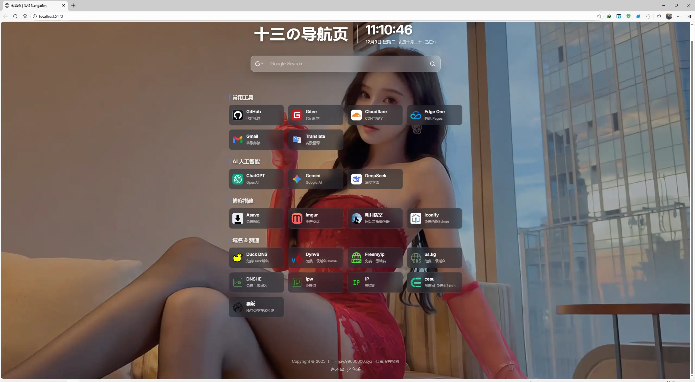

# Sinc Nav - 极简个人导航页

一个基于 Vue 3 和 VitePress 构建的现代化、高颜值个人导航起始页。提供多引擎搜索、实时农历日期显示以及沉浸式动态背景体验。



## ✨ 功能特性

- **⏱️ 实时信息**：显示当前时间、公历日期以及中国农历（年份/月份/日期）。
- **🔍 多引擎搜索**：内置 Google、百度、Bing 搜索引擎，支持一键切换。
- **🖼️ 沉浸式背景**：支持静态图片或 MP4 视频作为动态壁纸。
- **📱 响应式设计**：完美适配桌面端与移动端访问。
- **⚡ 技术栈**：基于 Vue 3 Composition API + VitePress + Lunar-javascript。

## 🛠️ 安装与运行

确保您的环境已安装 [Node.js](https://nodejs.org/) (推荐 v16+)。

### 1. 克隆/下载项目
下载本项目源码并解压。
```
git clone [https://github.com/NightWish177/sinc-nav.git](https://github.com/NightWish177/sinc-nav.git)
cd your-repo-name
```

### 2. 安装依赖
在项目根目录下运行：

```bash
# 使用 npm
npm install

# 或者使用 pnpm (推荐)
pnpm install
```

### 3. 本地开发

启动本地开发服务器：

```bash
pnpm dev
```
### 4. 打包构建
生成静态文件（通常位于 .vitepress/dist）：


```bash
npm run build
# 或 pnpm build
```
⚙️ 配置说明
您可以在 VitePress 的配置文件（通常是 .vitepress/config.js 或 themeConfig）中修改首页配置：
```
JavaScript

// .vitepress/config.js
export default {
  themeConfig: {
    // 首页配置项
    startPage: {
      title: '您的标题',           // 页面大标题
      bgImage: '/bg.jpg',        // 背景图片路径 (如果设置了视频，优先显示视频)
      bgVideo: '/bg.mp4'         // 背景视频路径
    }
  }
}
```

```
📂 目录结构
Plaintext
.
├── docs/
│   ├── .vitepress/          # VitePress 配置与主题文件
│   │   ├── theme/
│   │   │   ├── components/  # 组件目录 (HomeStart.vue 等)
│   │   │   └── ...
│   └── 1.webp               # 项目预览图
├── package.json
└── README.md
```
📄 许可证
MIT License